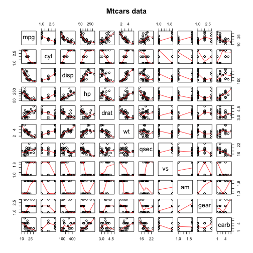
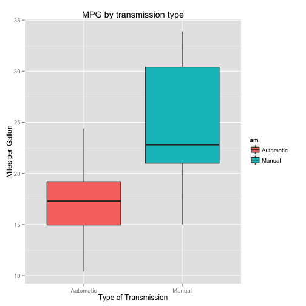
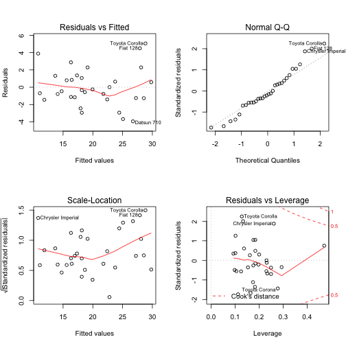

MPG change for Automatic vs Manual Transmission Cars
===================================================

## Executive Summary

Motor Trend, an automobile trend magazine is interested in exploring the relationship between a set of variables and miles per gallon (MPG) outcome. The data was extracted from the 1974 Motor Trend US magazine and comprises fuel consumption and 10 aspects of automobile design and performance for 32 automobiles (1973–74 models).

In this report, we aim to explore the relationship between a set of variables and miles per gallon (MPG) (outcome) to answer the following questions -
1. Is an automatic or manual transmission better for MPG(miles per gallon)?
2. What is the amount of the MPG(miles per gallon) difference between automatic and manual transmissions?

After performing the analysis it is concluded that Manual transmissions achieve a higher value of MPG when adjusted for all meaningful variables.This increase is approximately 1.8 MPG when switching from an automatic transmission to a manual one, with all else held constant.

## Data Processing

We obtain the mtcars data set, load and transform the data.

### Data load and Transformations

Load the mtcars data set and transform the level variables into factors

```r
data(mtcars)
mtcars$cyl <- factor(mtcars$cyl)
mtcars$vs <- factor(mtcars$vs)
mtcars$am <- factor(mtcars$am, labels = c("Automatic", "Manual"))
mtcars$gear <- factor(mtcars$gear)
mtcars$carb <- factor(mtcars$carb)
```

## Exploratory Analysis

To determine the correlations between the variables in the dataset, we make scatterplot matrix using pairs function(Appendix - Figure 1). From this plot, we learned that many variables like cyl, disp, hp, drat, wt, vs, am and carb have correlations with mpg. Hence, these relationships need to be considered while fitting a linear model.

In this analysis, we are interested in the effects of car transmission type(Automatic and Manual) on mpg. Using box plot(Appendix - Figure 2), we analyse the distribution of mpg for each of the twol levels of am(Automatic and Manual).  This plot clearly depicts that manual transmissions tend to have higher MPG. This data is further analyzed and discussed in regression analysis section by fitting a linear model.

## Regression Analysis

We build linear regression models using different variables in order to find the best fit. All these linear regression models are compared with the base model that includes all variables.

### Model building and selection

First, build the initial model that includes all the variables as the predictors for the outcome mpg. Then perform the stepwise model selection to select the significant predictors for the best fit final model.

The step function will perform this selection by calling lm repeatedly. It selects the best variables to use in predicting mpg with the Akaike information criterion that implements both forward selection and backward elimination. This ensures that we have included useful variables while omitting ones that do not contribute significantly to predicting mpg.

From the bestModel(Appendix Figure 3) it is shown that variables cyl, hp, wt and am are all significant variables in predicting mpg. The adjusted R-squared value of 0.8401 tells us that 84% of the variability is explained by this model.


```r
initialModel <- lm(mpg ~., data = mtcars)
bestModel <- step(initialModel, direction = "both")
```

Fit another model with mpg as outcome and am as the only one predictor. Using anova function compare all the three models - singleModel, bestModel and initialModel (Appendix Figure 4). 

From the comparision of bestModel with singleModel, as the p-value of bestModel is very small, the null hypothesis that these predictor variables do not contribute to the model can be rejected. But for the comparision of initialModel with bestModel, as the p-value is greater than α=0.05, the null hypothesis that these predictor values do not contribute to the model cannot be rejected. From these comparisions it is deduced that the bestModel fits better than singleModel(only am as predictor) and initialMode(all variables as predictors).

### Model Diagnostics

From the bestModel plot(Appendix - Figure 5), we examine the residuals and find leverage points that help to find any potential problems with the model. The following observations have been made from the plots.

-From Residuals vs Fitted values plot, the residuals are randomly scattered and verify the independence condition.
-The normal Q-Q plot shows points fall on or close to the line, hence residuals are approximately normally distributed.
-The Scale-Location plot has a constant width in points, hence no heteroskedasticity.
-There are some leverage points that indicate the presence of outliers.

## Statistical Inference

We perform a t-test on the two subsets of mpg data(automatic or manual) assuming that the transmission data has a normal distribution and tests the null hypothesis that they come from the same distribution. By default, this performs a two-sided test with α=0.05 and assuming unequal variances. The t-test results clearly allow us to reject the null hypothesis that the mpg distributions for manual and automatic transmissions are the same(Appendix - Figure 6).

## Conclusions

Based on the analysis performed in this project, we can conclude that cars with Manual transmission get 1.8 more miles per gallon compared to cars with Automatic transmission(from bestModel summary). This is adjusted for horsepower, number of cylinders and vehicle weight.

## Appendix

### Figure 1 - Scatterplot matrix of mtcars dataset


```r
pairs(mtcars, panel = panel.smooth, main = "Mtcars data")
```

 

### Figure 2 - Boxplot of mpg vs am varibales


```r
ggplot(mtcars, aes( x = am, y = mpg, fill = am)) + geom_boxplot() +
    labs(x="Type of Transmission", y="Miles per Gallon", title="MPG by transmission type")
```

 

### Figure 3 - BestModel Summary


```r
summary(bestModel)
```

```
## 
## Call:
## lm(formula = mpg ~ cyl + hp + wt + am, data = mtcars)
## 
## Residuals:
##     Min      1Q  Median      3Q     Max 
## -3.9387 -1.2560 -0.4013  1.1253  5.0513 
## 
## Coefficients:
##             Estimate Std. Error t value Pr(>|t|)    
## (Intercept) 33.70832    2.60489  12.940 7.73e-13 ***
## cyl6        -3.03134    1.40728  -2.154  0.04068 *  
## cyl8        -2.16368    2.28425  -0.947  0.35225    
## hp          -0.03211    0.01369  -2.345  0.02693 *  
## wt          -2.49683    0.88559  -2.819  0.00908 ** 
## amManual     1.80921    1.39630   1.296  0.20646    
## ---
## Signif. codes:  0 '***' 0.001 '**' 0.01 '*' 0.05 '.' 0.1 ' ' 1
## 
## Residual standard error: 2.41 on 26 degrees of freedom
## Multiple R-squared:  0.8659,	Adjusted R-squared:  0.8401 
## F-statistic: 33.57 on 5 and 26 DF,  p-value: 1.506e-10
```

### Figure 4 - Anova comaprision of models


```r
singleModel <- lm(mpg ~ am, data = mtcars)
anova(singleModel, bestModel, initialModel)
```

```
## Analysis of Variance Table
## 
## Model 1: mpg ~ am
## Model 2: mpg ~ cyl + hp + wt + am
## Model 3: mpg ~ cyl + disp + hp + drat + wt + qsec + vs + am + gear + carb
##   Res.Df    RSS Df Sum of Sq       F     Pr(>F)    
## 1     30 720.90                                    
## 2     26 151.03  4    569.87 17.7489 0.00001476 ***
## 3     15 120.40 11     30.62  0.3468     0.9588    
## ---
## Signif. codes:  0 '***' 0.001 '**' 0.01 '*' 0.05 '.' 0.1 ' ' 1
```

### Figure 5 - Plot for BestModel Fit


```r
par(mfrow=c(2, 2))
plot(bestModel)
```

 

### Figure 6 - T-test for mpg distribution on transmission


```r
t.test(mpg ~ am, data = mtcars)
```

```
## 
## 	Welch Two Sample t-test
## 
## data:  mpg by am
## t = -3.7671, df = 18.332, p-value = 0.001374
## alternative hypothesis: true difference in means is not equal to 0
## 95 percent confidence interval:
##  -11.280194  -3.209684
## sample estimates:
## mean in group Automatic    mean in group Manual 
##                17.14737                24.39231
```


